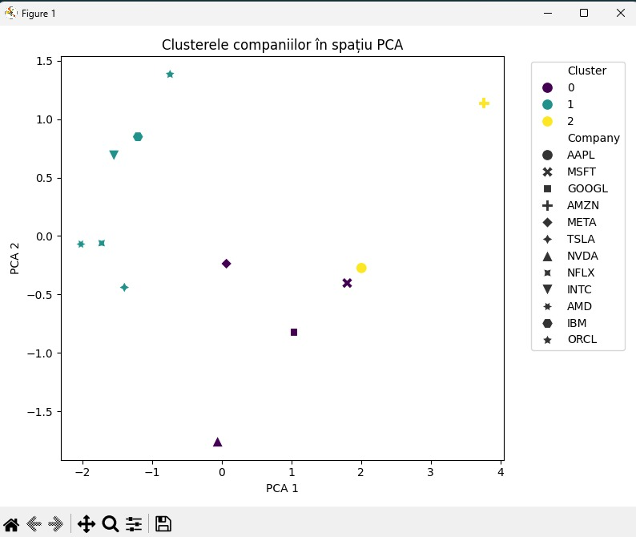

# 📊 Market Clustering AI

This project builds an AI agent that analyzes publicly traded companies based on financial indicators and automatically groups them into clusters using unsupervised learning (K-Means). It aims to help investors identify similar companies and understand market structures through data-driven insights.

---

## 🧠 Objective

To analyze companies and group them based on financial similarity and risk, using the following technologies:

- **Language**: Python
- **Libraries**: `yfinance`, `pandas`, `scikit-learn`, `matplotlib`, `seaborn`
- **Machine Learning**: K-Means (Unsupervised Learning)
- **Visualization**: PCA (Principal Component Analysis)

---

## 📥 Data Source

Company data is collected in real-time using the **Yahoo Finance API** (`yfinance`). Each company is represented by the following key financial indicators:

- `MarketCap` – Market Capitalization
- `Revenue` – Total Revenue
- `Profit` – Gross Profit
- `Debt` – Total Debt

---

## 📈 Clustering Approach

The model uses **K-Means Clustering** to group companies into 3 clusters based on the 4 financial indicators.  
Data is preprocessed using `StandardScaler`, and visualized using `PCA` for 2D representation.

Example output:  


---

## 📁 Project Structure

```

market-clustering/
├── data/
│   └── clustered\_companies.csv       # Output file with clusters
├── main.py                           # Main script
├── requirements.txt                  # Required Python libraries
├── .gitignore                        # Files to be excluded from Git
└── README.md                         # This file

````

---

## ▶️ How to Run

1. Clone the repo:
   ```bash
   git clone https://github.com/yourusername/market-clustering.git
   cd market-clustering
````

2. Create and activate a virtual environment:

   ```bash
   python -m venv .venv
   .venv\Scripts\activate  # on Windows
   ```

3. Install dependencies:

   ```bash
   pip install -r requirements.txt
   ```

4. Run the project:

   ```bash
   python main.py
   ```

---

## 📊 Example Output CSV

Each company is assigned a cluster (0, 1, or 2) based on its financial profile:

```
Company,MarketCap,Revenue,Profit,Debt,Cluster
AAPL,3018375823360,400366010368,1866990005952,981860002432,2
...
```

---

## 📌 Extensions (optional)

* Integrate with a **Knowledge Graph** to visualize relations between companies (e.g., by sector)
* Add extra indicators: `beta`, `sector`, `priceToEarnings`

